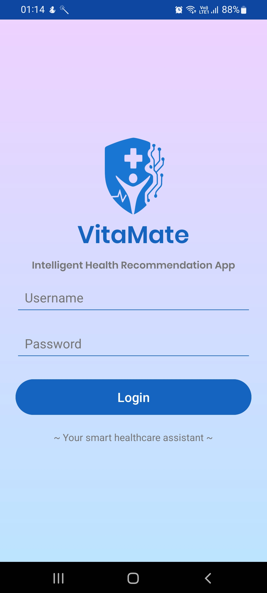
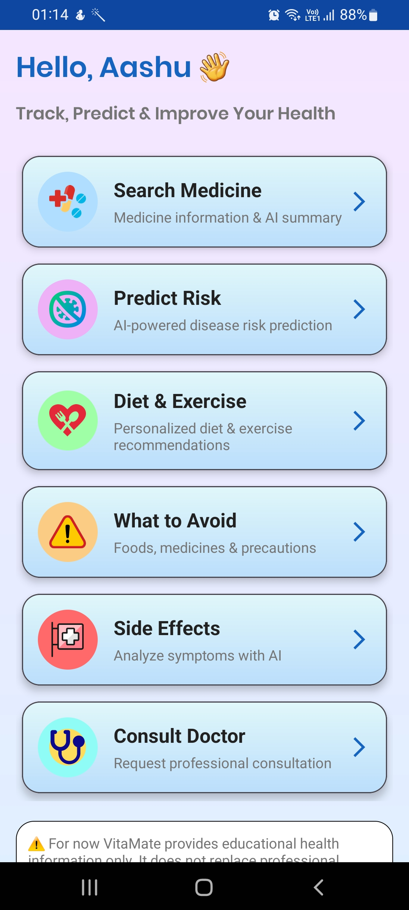
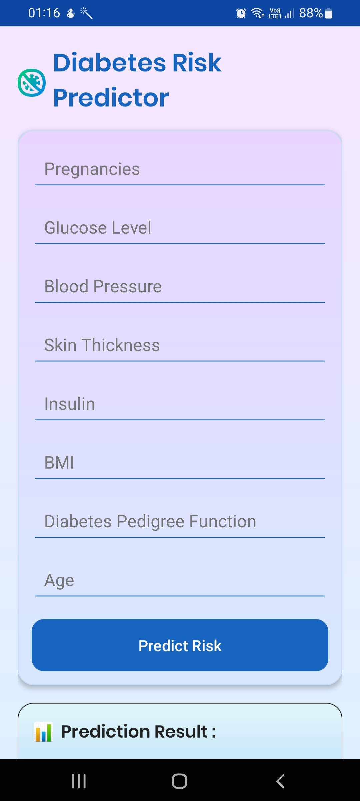
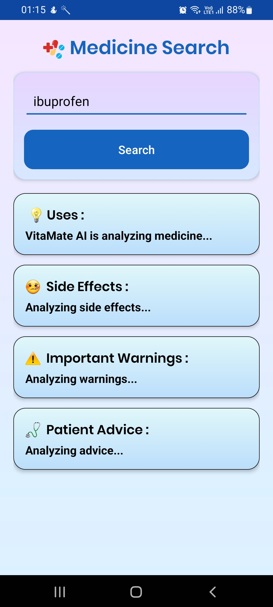
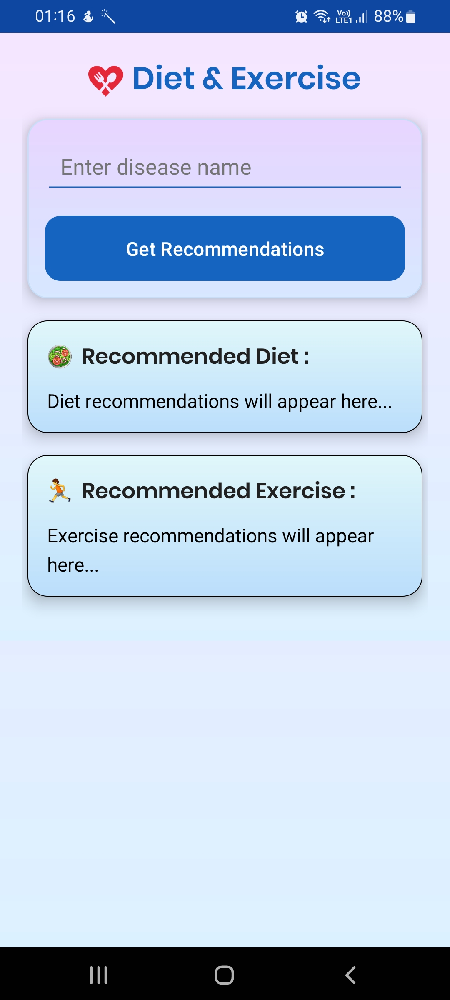
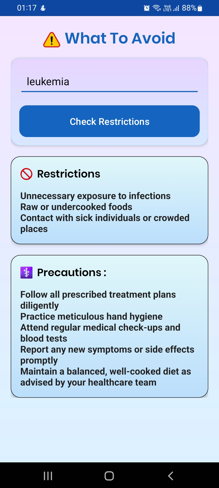
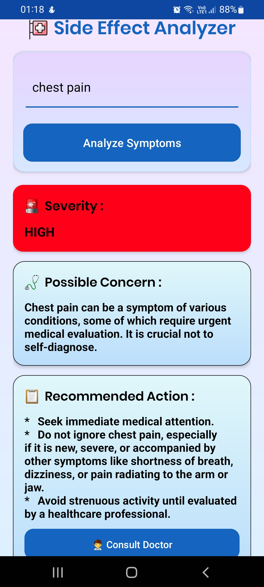
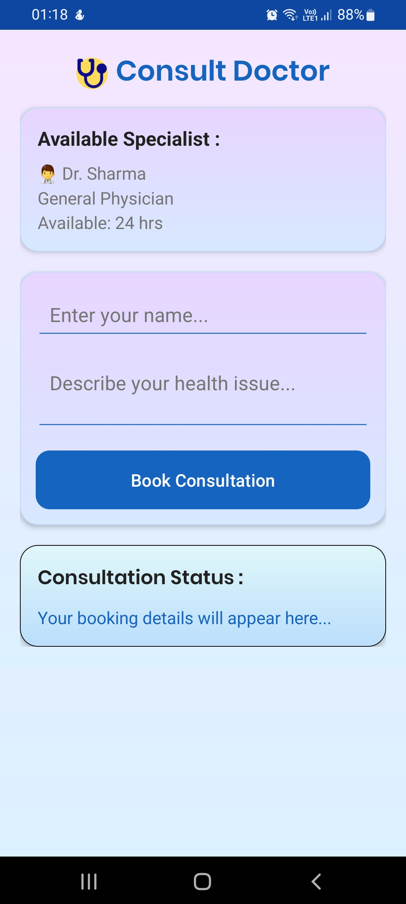

# 🩺 VitaMate – Intelligent Health Recommendation System

An AI-powered Android healthcare application that combines **Machine Learning**, **Artificial Intelligence**, and **healthcare APIs** to assist users with disease risk prediction, medicine information, personalized health recommendations, side-effect analysis, and doctor consultation support.

---

## 📱 Demo

🎥 **Project Demo:** https://drive.google.com/file/d/1fa0448zpRZ7TjOtruc7OQU6z5BkrtvM8/view?usp=drive_link

📦 **APK File:** https://drive.google.com/file/d/1PBs1DMPIXsMEwmixpPoAEa1wLGv3PL74/view?usp=sharing

🔗 **GitHub Repository:** https://github.com/Aashu-Kumar/TrialVitaMate

---

# 📖 Project Overview

VitaMate is an intelligent healthcare assistant designed to provide users with reliable medical guidance through Artificial Intelligence and Machine Learning.

The application integrates a trained **Random Forest Machine Learning model**, **Google Gemini API**, and the **OpenFDA API** to deliver accurate disease prediction, medicine analysis, personalized recommendations, and healthcare awareness—all within a single Android application.

Unlike conventional healthcare applications that focus on only one feature, VitaMate provides multiple healthcare services through a unified and user-friendly interface.

---

# ✨ Features

- 🔐 User Login
- 🤖 AI-Powered Healthcare Assistant
- 💊 Medicine Search using OpenFDA API
- 🧠 AI Medicine Summary using Gemini
- 📈 Diabetes Risk Prediction using Random Forest (ONNX)
- 🥗 Personalized Diet Recommendations
- 🏃 Exercise Recommendations
- ⚠️ "What To Avoid" Guidance
- 🚨 AI Side Effect Analyzer
- 👨‍⚕️ Doctor Consultation Module
- 🎨 Modern Material UI Design

---

# 🛠 Tech Stack

## Mobile Development

- Kotlin
- Android Studio
- XML
- Fragments
- RecyclerView

---

## Artificial Intelligence

- Google Gemini API
- Prompt Engineering

---

## Machine Learning

- Python
- Scikit-Learn
- Random Forest
- ONNX Runtime

---

## APIs

- OpenFDA API
- Gemini API

---

## Networking

- Retrofit
- Gson Converter

---

## Data & Assets

- ONNX Model
- JSON Parsing
- Assets Folder

---

# 📂 Project Structure

```text
VitaMate
│
├── gemini
│   ├── GeminiApiService
│   ├── GeminiRequest
│   ├── GeminiResponse
│   └── GeminiRetrofit
│
├── network
│   ├── ApiService
│   ├── MedicineResponse
│   └── RetrofitClient
│
├── model
│   └── UserData
│
├── ui
│   ├── LoginActivity
│   ├── MainActivity
│   ├── HomeFragment
│   ├── MedicineFragment
│   ├── PredictionFragment
│   ├── DietFragment
│   ├── AvoidFragment
│   ├── SideEffectFragment
│   ├── ConsultFragment
│   ├── FeatureAdapter
│   └── DiabetesPredictor
│
├── assets
│   └── diabetes_rf.onnx
│
├── res
│   ├── drawable
│   ├── layout
│   ├── values
│   └── font
│
└── AndroidManifest.xml
```

---

# 🚀 Getting Started

## Clone Repository

```bash
git clone https://github.com/Aashu-Kumar/TrialVitaMate.git
```

```bash
cd VitaMate
```

---

## Open Project

Open the project using **Android Studio**.

---

## Configure API Key

Add your Gemini API Key inside the project before running.

---

## Build Project

Sync Gradle and build the project.

---

## Run Application

Connect an Android device or emulator and run the application.

---

# ⚙️ How It Works

```text
User Login
        │
        ▼
Dashboard
        │
        ▼
Select Feature
        │
        ├──────────────► Medicine Search
        │                     │
        │                     ▼
        │             OpenFDA API
        │                     │
        │                     ▼
        │              Gemini AI Summary
        │
        ├──────────────► Disease Prediction
        │                     │
        │                     ▼
        │           Random Forest (ONNX)
        │
        ├──────────────► Diet & Exercise
        │                     │
        │                     ▼
        │               Gemini API
        │
        ├──────────────► What To Avoid
        │                     │
        │                     ▼
        │               Gemini API
        │
        ├──────────────► Side Effect Analyzer
        │                     │
        │                     ▼
        │               Gemini API
        │
        └──────────────► Consult Doctor
```

---

# 🤖 Machine Learning Pipeline

```text
Healthcare Dataset
        │
        ▼
Data Preprocessing
        │
        ▼
Random Forest Training
        │
        ▼
Model Evaluation
        │
        ▼
Convert to ONNX
        │
        ▼
Android Assets
        │
        ▼
ONNX Runtime
        │
        ▼
Disease Prediction
```

---

# 📷 Application Screens

## Login & Dashboard

| Login | Dashboard |
|-------|-----------|
|  |  |

---

## Disease Prediction & Medicine Search

| Disease Prediction | Medicine Search |
|-------------------|-----------------|
|  |  |

---

## Diet & Exercise | What To Avoid

| Diet & Exercise | What To Avoid |
|----------------|---------------|
|  |  |

---

## Side Effect Analyzer | Doctor Consultation

| Side Effect Analyzer | Consult Doctor |
|----------------------|----------------|
|  |  |

---

# 📊 Machine Learning Results

## Diabetes Dataset

| Model | Accuracy |
|--------|----------|
| Logistic Regression | 73.59% |
| Decision Tree | 70.56% |
| Random Forest | **76.19%** |
| Gradient Boosting | 75.76% |
| Voting Classifier | 75.32% |

---

## Heart Disease Dataset

| Model | Accuracy |
|--------|----------|
| Logistic Regression | 80.52% |
| Decision Tree | 97.08% |
| Random Forest | **99.03%** |
| Voting Classifier | 92.21% |

---

# 🎯 Key Highlights

- AI-assisted healthcare recommendations
- Machine Learning disease prediction
- OpenFDA medicine information
- Google Gemini integration
- ONNX Runtime deployment
- Modern Android architecture
- Clean and intuitive user interface

---

# 🚀 Future Improvements

- User Authentication using Firebase
- Health Report Generation (PDF)
- Cloud Database Integration
- Wearable Device Integration
- Real-time Doctor Appointment Booking
- Multi-language Support
- Voice Assistant
- Medication Reminder System
- AI Chatbot for Healthcare Queries

---

# 👨‍💻 Author

**Aashu Kumar**

🎓 B.Tech Computer Science & Engineering

GitHub: https://github.com/Aashu-Kumar

---

# 📄 License

This project was developed for educational and academic purposes as a final-year B.Tech project.
